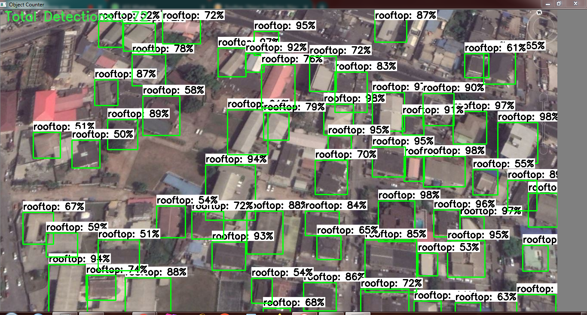

Abimbola Olawale is a Statistician and a Data Scientist whose researches are around data mining, machine learning, deep learning and computer vision. He is a graduate of statistics and currently works as a Data Scientist at Data Science Nigeria, which is a non-profit organisation aiming to develop Nigeria’s AI 
  ecosystem and also build 1 million AI talent in ten years. He is part of the crowdsourcing research team that works on getting and analysing data efficiently from different users across various location.

- 🔭 I am also applying Computer Vision in Sport Analytics

- 👯 I’m open to collaborating on Projects and StartUps for business and social good.  

- 💬 Talk to me about Computer Vision, Geospatial Analytics, Data Science, Robotics Process Automation, Data Engineering, Open Source.

<h2> Connect with me  </h2>
 
 
 
 

<h2> My GitHub Stats  </h2> 

  
  

# Portfolio

### Visualization of Clustered Countries 

<iframe src="https://abimbola-olawale.shinyapps.io/WQU_CRT_M1/" frameborder="0" width="120%" height="500" allowfullscreen="true" mozallowfullscreen="true" webkitallowfullscreen="true"></iframe>

### Advance Convolution Neural networks (CNN) approach in Classifying COVID19 CT Scan Images

Comparing the Performance of Customized architecture of AlexNet and ResNet in classifying COVID-19 CT Scan images and Normal Images and was deployed using streamlit framework

### Counting buildings and identifying points of interest

The identification of buildings in Africa looks so daunting due to the irregularity in the arrangement of buildings in various settlements.This project focuses on developing a framework which will help in counting buildings and subsequently identify points of interest by applying object detection.

### Classification of Computer Virus in Windows Environment Using Advance CNN approach
 

The data consist of about 26 classes of different types of virus images. The purpose of this project was to present a better model which could
outperform models presented by other researchers. To achieve this, we applied Xception transfer learning model for the feature extraction and and our model was trained using LightGBM

